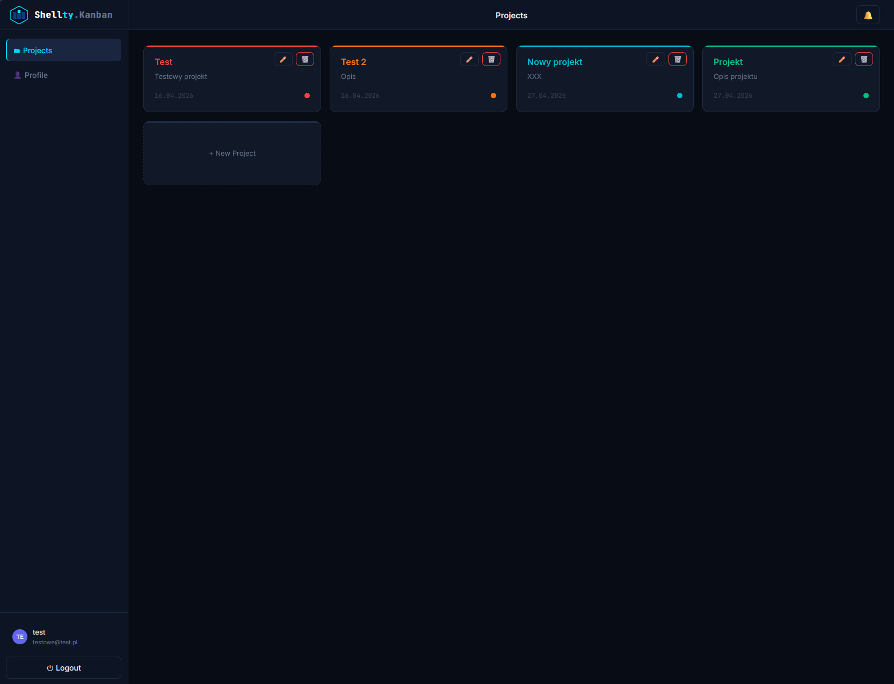
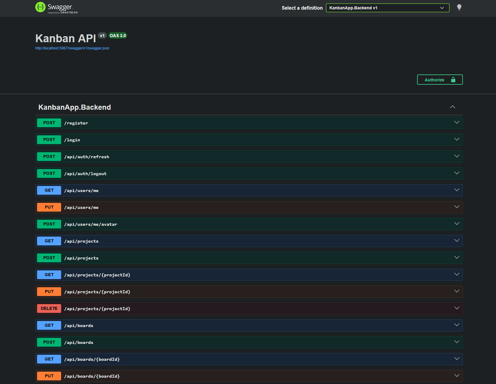

# Shellty.Kanban - Menadżer Projektów

<div align="center">


RESTful API backendowe dla zespołowej aplikacji Kanban do zarządzania zadaniami.
Zbudowane w ASP.NET Core 10 Minimal API, wdrożone na Render i Netlify.

**[🌐 Live App](https://shellty-kanban.netlify.app)  · [👤 LinkedIn](https://www.linkedin.com/in/tomasz-skorupski-shellty)**

</div>

---

## Zrzuty ekranu

| Dashboard | Swagger UI |
|---|---|
|  |  |

---

## O projekcie

KanbanApp to pełnostackowa aplikacja tablicy Kanban stworzona jako projekt portfolio w ramach Engineering Academy z Nerds Family.

Backend dostarcza kompletne REST API do zarządzania zespołami, projektami, tablicami, kolumnami i kartami - z uwierzytelnianiem JWT, dostępem opartym na rolach, wyszukiwaniem kart, powiadomieniami i uploadem plików.

**Główne funkcje:**
- Hierarchia Projekty → Tablice → Kolumny → Karty
- Tokeny JWT + rotacja refresh tokenów
- Dostęp do tablic oparty na rolach (Owner / Member)
- Przypisywanie kart z powiadomieniami
- Wyszukiwanie kart po tekście
- Upload avatara, terminy realizacji, kolorowe etykiety

---

## Stack techniczny

| | |
|---|---|
| **Framework** | ASP.NET Core 10 – Minimal API |
| **ORM** | Entity Framework Core 10 |
| **Auth** | ASP.NET Identity + JWT Bearer |
| **Baza danych** | SQLite (lokalnie) → Neon PostgreSQL (produkcja) |
| **Testy** | xUnit + EF InMemory + WebApplicationFactory |
| **CI/CD** | GitHub Actions → Render / Netlify |

---

## Architektura

Projekt ma warstwową strukturę z wyraźnym podziałem odpowiedzialności.

**Endpoints** obsługują tylko routing HTTP -  żadnej logiki biznesowej.
**Services** zawierają całą logikę biznesową i są wstrzykiwane przez DI.
**Authorization handlers** egzekwują polityki dostępu na poziomie tablicy.
**Extensions** utrzymują `Program.cs` czysty i czytelny.
KanbanApp.Backend/
│
├── Endpoints/ Handlery tras HTTP (Auth, Board, Card, Column, Project, User, Notification)
├── Services/ Logika biznesowa (BoardService, CardService, UserService)
├── Models/ Encje EF Core
├── DTOs/ Obiekty żądań i odpowiedzi
├── Authorization/ Handlery polityk (IsBoardOwner, IsBoardMember)
├── Data/ ApplicationDbContext
├── Extensions/ AddAuth(), AddDatabase(), AddAppServices(), AddSwagger()
└── Migrations/ Migracje EF Core (SQL Server)


`Program.cs` jest celowo minimalny:

```csharp
builder.Services.AddDatabase(builder.Configuration, builder.Environment);
builder.Services.AddAuth(builder.Configuration);
builder.Services.AddAppServices();
builder.Services.AddSwagger();
Endpointy API
Auth
Metoda	Endpoint	Auth	Uwagi
POST	/register	-	Rate limit – 5 żądań/min
POST	/login	-	Zwraca accessToken + refreshToken
POST	/api/auth/refresh	-	Rotuje refresh token
POST	/api/auth/logout	JWT	Unieważnia refresh token
Projekty · Tablice · Kolumny · Karty
Metoda	Endpoint	Uwagi
GET POST	/api/projects	
PUT DELETE	/api/projects/{id}	
GET POST	/api/boards	
PUT DELETE	/api/boards/{id}	
GET POST	/api/boards/{id}/columns	
PUT DELETE	/api/boards/{id}/columns/{columnId}	
GET POST	/api/boards/{id}/cards	
PUT DELETE	/api/boards/{id}/cards/{cardId}	
PUT	/api/boards/{id}/cards/{cardId}/assign	Tworzy powiadomienie
GET	/api/boards/{id}/cards/search?q=	Szukaj po tytule / opisie
GET POST	/api/boards/{id}/members	
Użytkownicy · Powiadomienia
Metoda	Endpoint	Uwagi
GET PUT	/api/users/me	
POST	/api/users/me/avatar	Upload pliku
GET	/api/notifications	
PUT	/api/notifications/{id}/read	
PUT	/api/notifications/read-all	
Wszystkie powyższe endpointy wymagają tokenu JWT Bearer.

Uwierzytelnianie
API używa strategii dwóch tokenów - krótkotrwałe tokeny dostępu z rotowanymi refresh tokenami przechowywanymi w bazie danych.


POST /login
  → accessToken  (JWT, 15 min)
  → refreshToken (64 losowe bajty, 7 dni, zapis w DB)

Po 401 → POST /api/auth/refresh
  → stary refresh token zostaje unieważniony
  → wydawana jest nowa para tokenów
  → oryginalne żądanie jest ponawiane automatycznie (interceptor axios)
Bezpieczeństwo:

Token dostępu wygasa po 15 minutach
Refresh token jednorazowy, rotowany przy każdym odświeżeniu
Endpointy auth: rate limit 5 żądań/min (HTTP 429)
Dostęp do tablic egzekwowany przez polityki IsBoardOwner / IsBoardMember
CORS ograniczony wyłącznie do domeny frontendu
Testy
60 testów integracyjnych - wszystkie przechodzą.


KanbanWebAppFactory
  └── podmienia DbContext na EF InMemory (unikalna baza na każdy test run)
  └── wyłącza rate limiter przez RateLimiting:Disabled=true

Helpery TestBase
  ├── CreateAuthenticatedClientAsync()
  ├── CreateBoardAsync()
  ├── CreateColumnAsync()
  ├── CreateCardAsync()
  └── CreateProjectAsync()
Zestaw	Testy	Pokrycie
CardTests	14	100%
ColumnTests	10	100%
ProjectTests	10	98,2%
AuthTests	8	96,8%
BoardTests	12	~95%
UserProfileTests	4	54,5%
Łącznie	60	~95%
Bash

dotnet test --collect:"XPlat Code Coverage"
Uruchomienie lokalne
Bash

git clone https://github.com/Shellty-IT/KanbanApp_Project.git
cd KanbanApp_Project/KanbanApp.Backend

dotnet restore
dotnet ef database update
dotnet run
API: http://localhost:5067
Swagger: http://localhost:5067/swagger
appsettings.Development.json:

JSON

{
  "Jwt": {
    "Key": "twój-sekretny-klucz-minimum-32-znaki"
  },
  "ConnectionStrings": {
    "DefaultConnection": "Data Source=kanban.db"
  }
}
Wdrożenie
Wdrażane na Render (Backend) i Netlify (Frontend) przy każdym pushu do main przez GitHub Actions.


push do main
  ├── dotnet restore + build
  ├── dotnet test              (wszystkie 60 testów musi przejść)
  ├── dotnet publish
  └── deploy
Zasób	Nazwa
Backend	https://smartquote-backend-fzh5.onrender.com
Frontend	https://shellty-kanban.netlify.app
Baza danych	PostgreSQL – Neon (https://neon.com)

Autor
Shellty – Tomasz Skorupski

GitHub
LinkedIn

Projekt portfolio – Engineering Academy z Nerds Family